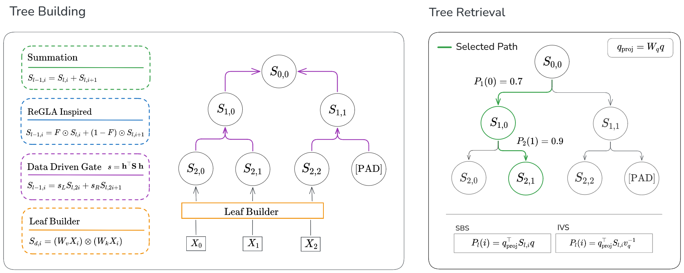

# 🍬 TreaT: Tree Attention for Efficient Retrieval

**TreaT** is a research framework for exploring hierarchical attention mechanisms in NLP. It implements a binary attention tree that enables top-$k$ retrieval in logarithmic time, while supporting end-to-end training via a distillation pipeline into a frozen linear attention encoder.

---

## 🚧 Architecture



⚠️ *The TreaT architecture is purely experimental. It is not GPU efficient yet* ⚠️

## 📁 Project Structure

```bash
treat/
├── main.py                 # CLI entrypoint
├── requirements.txt        # Python dependencies
├── plots/                  # Auto-saved visualizations
└── sources/
    ├── argparser.py        # Argument parsing logic
    ├── custom\_datasets.py  # Dataset loading
    ├── gating.py           # Fusion mechanisms
    ├── study.py            # Main experiment logic
    ├── teacher.py          # Teacher model and distillation
    ├── train.py            # Training loop logic
    ├── treat.py            # Core TreaT model
    ├── tree\_builders.py    # Tree construction logic
    └── init.py
```

## 🚀 Getting Started

Install dependencies:

```bash
pip install -r requirements.txt
```

---

## 🛠️ Usage

Run the experiment script via:

```bash
python main.py study [format] [--args...]
```

### 📘 Example:

```bash
python main.py study full \
    --dataset wikitext2 \
    --emb_model sentence-transformers/all-MiniLM-L6-v2 \
    --depth 7 \
    --batch-size 8 \
    --gating data-driven \
    --scoring ivs \
    --teacher-epochs 40 \
    --student-epochs 10
```

---

## 🎛️ Arguments

| Argument           | Description                                                                 |
| ------------------ | --------------------------------------------------------------------------- |
| `format`           | Study type. Options: `full`, `bla`                                          |
| `--emb_model`      | Embedding model (default: `sentence-transformers/all-MiniLM-L6-v2`)         |
| `--depth`          | Tree depth (2–8), controls memory hierarchy granularity                     |
| `--dataset`        | Dataset name (from `sources/custom_datasets.py`)                            |
| `--batch-size`     | Batch size for training                                                     |
| `--display-freq`   | How often to print intermediate results                                     |
| `--save-plot-freq` | Plot-saving frequency (in steps)                                            |
| `--gating`         | Fusion mechanism: `summation`, `gated`, or `data-driven`                    |
| `--scoring`        | Scoring method: `sbs` (Symmetric Bilinear) or `ivs` (Inverse Value Scoring) |
| `--teacher-epochs` | Number of epochs for training the teacher                                   |
| `--student-epochs` | Number of epochs for training the student (linear attention model)          |

---

## 🧪 Datasets

Supported datasets include:

* `wikitext2` (default)
* See all options in `sources/custom_datasets.py` under `arg_to_dataset`

---

## 📈 Outputs

Visual results and plots are saved to the `plots/` folder. These include:

* Propagation error curves
* Accuracy degradation plots (based on `--save-plot-freq`)

---

## 📝 Paper

You can find more detail on the architecture and experiments here:
[NLP_Report-2.pdf](https://github.com/user-attachments/files/20845331/NLP_Report-2.pdf)

---

## 🧩 Acknowledgements

* [Hugging Face Transformers](https://huggingface.co/transformers/) for model backbones
* [SentenceTransformers](https://www.sbert.net/) for efficient embedding models
* [PyTorch](https://pytorch.org/) for training infrastructure

---

## 🧑‍💻 Contributors

* \[Justin Duc]: Research
* \[Shani Kagan]: Research

---
